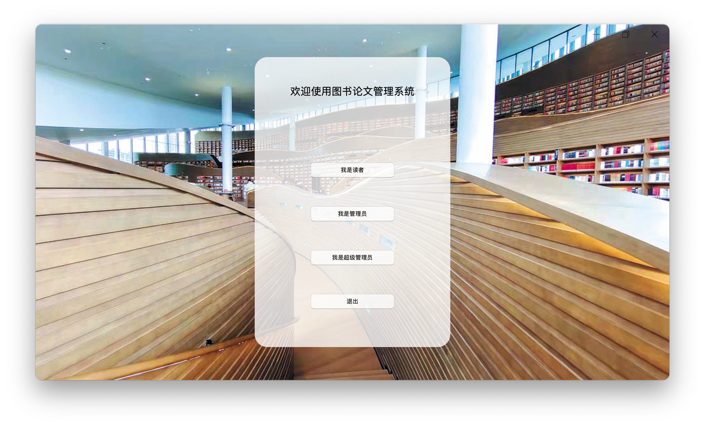
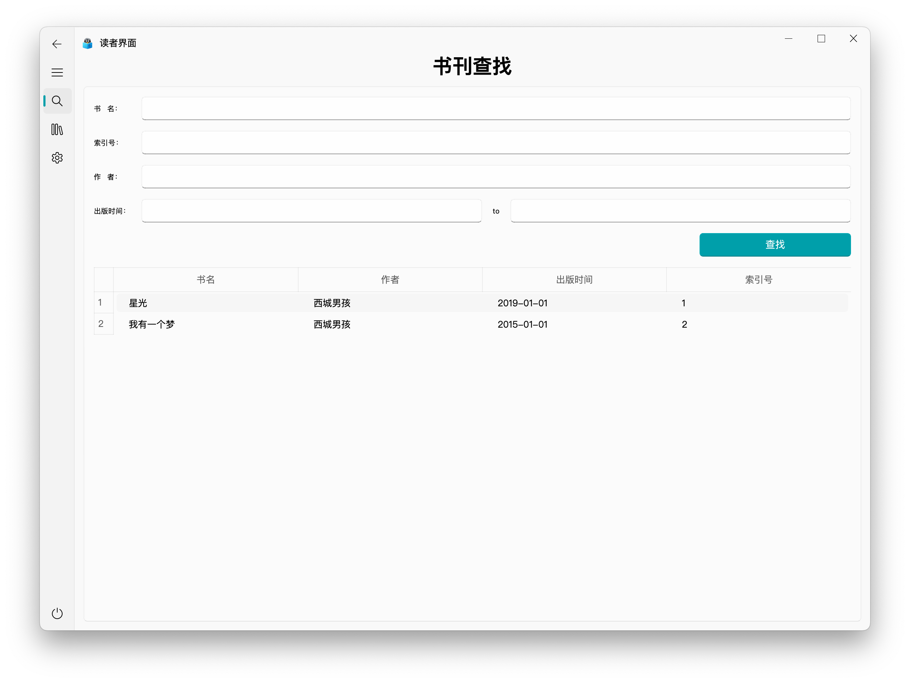
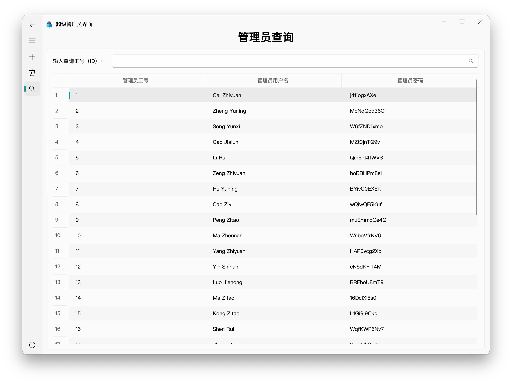

# 图书管理系统

本项目基于[WHU_DB 资料管理系统](https://github.com/JOETtheIV/WHU_DB)，重构了部分代码，并重新绘制了UI

技术栈：Python3 + PyQt5 + PyQt-Fluent-Widgets

数据库：MySQL

功能：
  用户管理：用户注册、修改信息、借书还书、浏览读者
  图书管理：增删改查
  管理员管理：增删查

 更改Lib_DB.py中的参数可连接本地MySQL，同时运行StartClient.py启动客户端，超级管理员用户密码默认在代码中

 通过登录超级管理员界面创建管理员，通过登录读者界面可以注册读者

